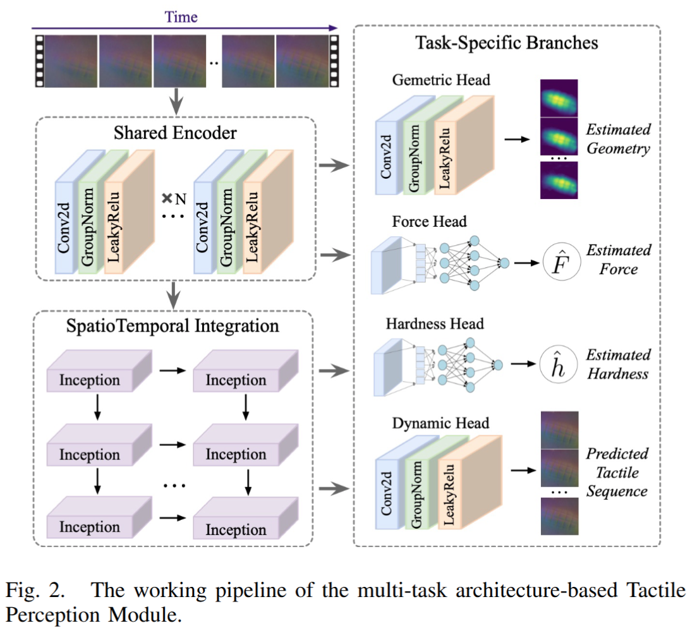
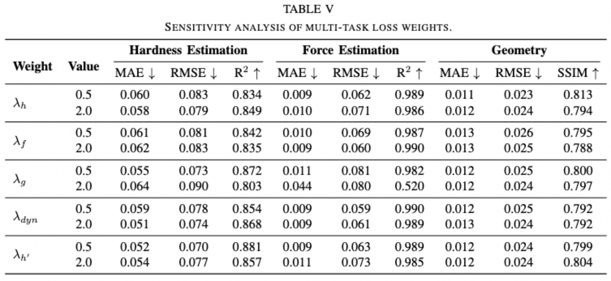

# Tactile Perception Module 

## Module Overview

As shown in figure below, a Multi-task perception architecture is designed to process raw tactile sequence through a unified architecture, simultaneously extracting critical interactive information and object properties. 




## Usage


### Running the Inference
```bash
python inference.py
```


## Loss weights sensitiviy: 

As shown in the table below, we employed a single-variable analysis strategy to clearly isolate the impact of each weight, varying each λi over the values {0.5, 1.0, 2.0} while fixing the others at the baseline value of 1.0. The results indicate that our model's performance is largely stable across this range. Moreover, a key finding is that a higher geometry weight (λ=2.0) harms physical property estimation. This reveals a latent trade-off between appearance and physics perception, where over-prioritizing either objective may undermine this balance. Our baseline loss weighting therefore operates within a stable and effective regime.




