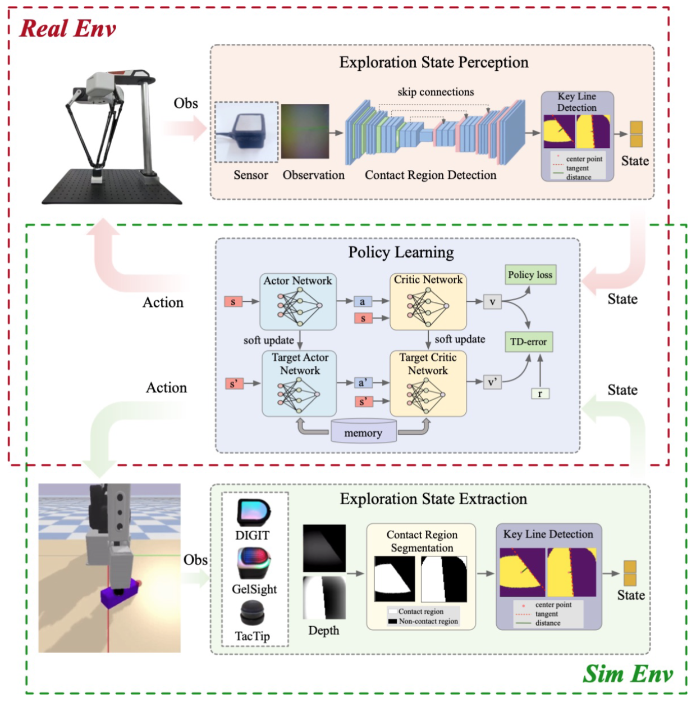

# Active Exploration Module 

## Module Overview

The active exploration module first utilizes fine-grained tactile input to stably follow target edges, and is then followed by internal sampling for detailed reconstruction.




## Functionality
The `inference.py` script implements a vision-based control system that performs the following steps:

1. **Image Preprocessing**: 
   - Crops the input image to focus on the central region (128x128 pixels)

2. **Image Segmentation**:
   - Uses a pre-trained U-Net model to segment the image into two classes
   - Converts the segmentation output into a binary mask

3. **Edge Extraction**:
   - Extracts edges from the segmentation mask

4. **Policy Inference**:
   - Uses a pre-trained DDPG model to determine an action based on the edge information
   - The action is converted into movement coordinates

## Usage


### Command Line Arguments
The script accepts the following command line arguments:

- `--model_unet_path`: Path to the pre-trained U-Net model
- `--policy_path`: Path to the pre-trained policy model
- `--img_path`: Path to the input image for inference

### Running the Inference
```bash
python inference.py --model_unet_path <path_to_unet_model> --policy_path <path_to_policy_model> --img_path <path_to_image>
```

### Output
The script outputs the actions which represent movement coordinates based on the current interactive state.


