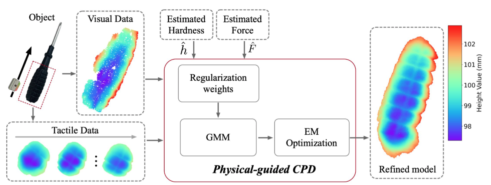
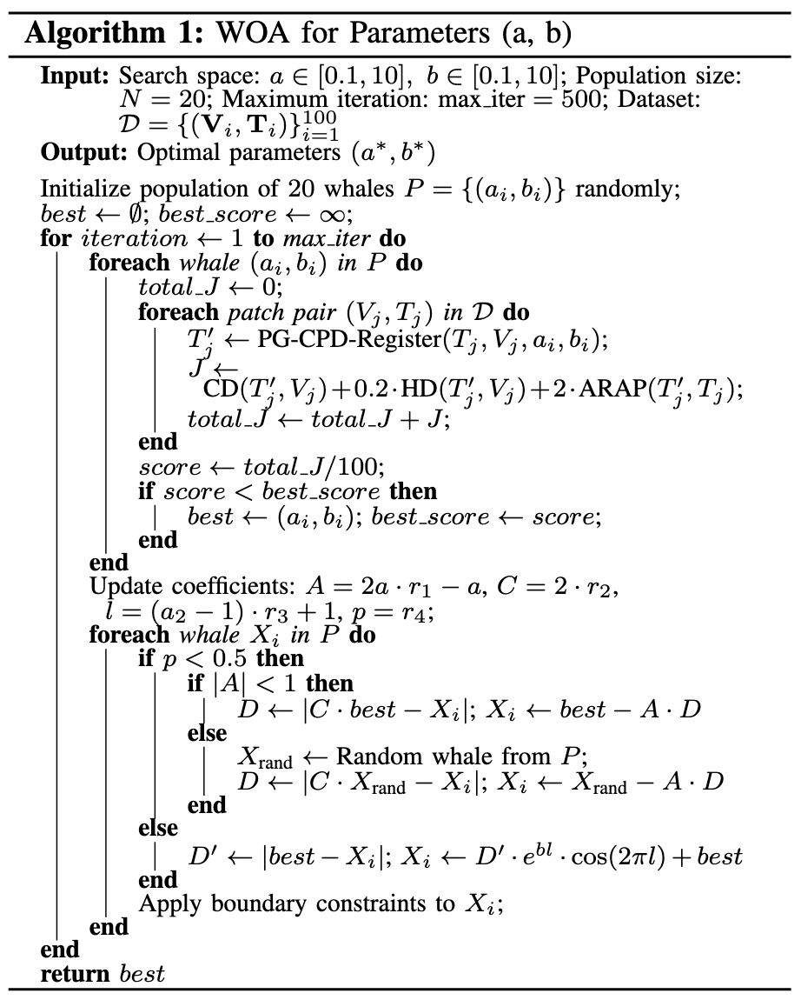

# Visual-Tactile Registration Module 

## Module Overview
By bridging the gap between local touch and global sight, this component maps high-resolution tactile data onto the visual guidance, enriching the model's fidelity.

## Pseudo-Code of WOA: 

