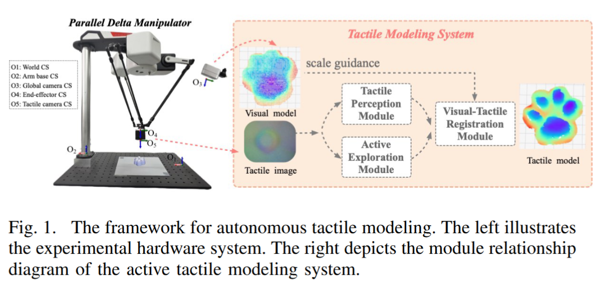

# Active Perception Driven Tactile Modeling of Deformable Objects for Robots

*This is an anonymous repository for review*


## Overview 

In this work, we propose a unified framework that leverages vision-based tactile sensors to construct fine-grained object models.
As shown in the figure below, our framework consists of three moodules:

(1) a multi-task perceptual module that estimates comprehensive physical properties from tactile sequences, including contact geometry, force, material hardness, and dynamic behavior. 

(2) an active exploration module that optimizes sampling efficiency for large objects by tracking their boundaries and sampling their interiors. 

(3) a visual-tactile registration module is combined to map the
indentation surface from the tactile sensor to a visual scale
with the help of physical attributes, enabling globally consistent
modeling even in deformable scenarios. 





## Install

```
# Clone the repository
git clone https://github.com/AnonymousProjectTactile/TactileModel 
cd TactileModel 

# Create a Virtual Environment
conda create --name TactileModel python=3.9
conda activate TactileModel

# Install dependencies from requirements.txt
pip install -r requirements.txt


```


## Project Structure 

- Module1/ - main source code of Tactile Perception Module
- Module2/ - main source code of Active Exploration Module 
- Module3/ - main source code of Visual-tactile Registration Module 
- Vodeo_demo/ - video demonstration of our system 
- requirements.txt - dependencies


